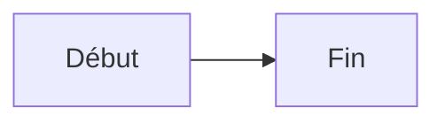

# 4. Rédiger des pages

[← Espaces de travail](03-espaces-de-travail.md) · [Retour au sommaire](README.md)

---

Les pages sont écrites en **Markdown** et découpées automatiquement en **sections**
éditables indépendamment. Une **barre d'outils** et un **menu `/`** facilitent la mise
en forme : tableaux, listes de tâches, diagrammes, images…

---

## Créer une page

Points d'entrée : la carte **« Nouvelle page »** sur l'accueil de l'espace, ou le
bouton **+** à côté de **« Pages »** dans la barre latérale.

La fenêtre **« Nouvelle page »** s'ouvre :

1. **Titre** de la page (obligatoire).
2. **Slug** — généré automatiquement à partir du titre, modifiable.
3. (Optionnel) **« Importer un fichier Markdown »** — importez un `.md`, `.markdown`
   ou `.txt`.
4. Cliquez sur **« Créer »** (ou **« Importer »**).

> En cas de slug déjà pris : *Un slug identique existe déjà dans cet espace.*

---

## Comprendre les sections

Le contenu est **automatiquement découpé en sections** à chaque titre de niveau 1 à 3
(`#`, `##`, `###`). C'est ce découpage qui permet les **verrous par section**
(voir [Collaboration temps réel](05-collaboration-temps-reel.md)).

---

## Modifier une page

### Le titre

Cliquez dans le champ du titre, modifiez, puis cliquez ailleurs : il est **enregistré
automatiquement**.

### Une section

1. Survolez la section : un bouton **« Éditer »** apparaît.
2. Cliquez : la section devient une **zone d'édition** avec une **barre d'outils** au-dessus.
3. Rédigez, puis **« Enregistrer »** (ou **« Annuler »**).

### La barre d'outils

Au-dessus de la zone d'édition, des boutons appliquent la mise en forme à la sélection :

| Bouton | Effet |
|---|---|
| **Gras** / **Italique** / **Barré** | `**gras**`, `*italique*`, `~~barré~~` |
| **Titre** | Préfixe `## ` |
| **Liste à puces** / **Liste de tâches** | `- ` / `- [ ] ` |
| **Citation** / **Code en ligne** | `> ` / `` `code` `` |
| **Tableau** | Ouvre l'éditeur de tableau visuel |
| **Diagramme** | Insère un squelette Mermaid |
| **Lien** / **Mention** | Insère un wikilien ou une mention @ |
| **Image / pièce jointe** | Envoie un fichier et l'insère |

### Le menu `/` (commandes rapides)

Tapez **`/`** en début de ligne : un menu s'ouvre pour insérer un élément (titre,
liste, tâche, citation, bloc de code, tableau, diagramme, lien, mention). Filtrez en
tapant (ex. `/tab` → Tableau), validez d'un clic.

---

## Syntaxe Markdown prise en charge

- Titres, **gras**, *italique*, `code`, blocs de code, listes, citations, tableaux
- Images, liens (URL brutes cliquables), traits horizontaux `---`
- **Listes de tâches** `- [ ]` → cases à cocher
- **Tableaux** et **diagrammes Mermaid** (voir ci-dessous)

> Le HTML brut est **désactivé** dans le rendu, pour la sécurité.

---

## Insérer un tableau

Cliquez sur **« Tableau »** dans la barre d'outils (ou `/tableau`). L'**éditeur visuel**
s'ouvre :

- **Ajouter / supprimer** des lignes et colonnes ;
- **éditer** chaque cellule ;
- **aligner** une colonne en cliquant sur son en-tête (défaut → gauche → centre → droite) ;
- **« Insérer »** génère un tableau **Markdown standard** (portable, versionné, comparable).

> Placez le curseur dans un tableau existant puis rouvrez **« Tableau »** pour le
> **modifier** dans l'éditeur visuel. Les tableaux sont conservés à l'**export**
> PDF et Word.

---

## Listes de tâches

Écrivez (ou insérez via la barre d'outils) :

```
- [ ] À faire
- [x] Fait
```

Elles s'affichent avec des **cases à cocher**.

---

## Diagrammes (Mermaid)

Insérez un bloc **Mermaid** (bouton **Diagramme** ou `/diagramme`) :

````

````

Le diagramme est **rendu automatiquement** (organigrammes, séquences, Gantt…), en
thème clair ou sombre. Une syntaxe invalide affiche un message d'erreur Mermaid sans
casser la page.

---

## Images & pièces jointes

Trois façons d'ajouter un fichier pendant l'édition :

- **Bouton « Image / pièce jointe »** dans la barre d'outils → choisissez un fichier ;
- **Glisser-déposer** un fichier sur la zone d'édition ;
- **Coller** une image depuis le presse-papiers.

Le fichier est **envoyé** (10 Mo max) puis inséré : les **images** s'affichent en place
(``), les autres fichiers sous forme de **lien**. Un indicateur *« Envoi du
fichier… »* s'affiche pendant l'upload.

> Les fichiers sont stockés sur votre instance et rattachés à l'espace de travail.

---

## Sommaire automatique

Dès qu'une page a au moins deux titres, un **Sommaire** repliable apparaît en haut :
cliquez sur une entrée pour aller à la section.

---

## Lier des pages entre elles (wikiliens)

| Vous écrivez | Résultat |
|---|---|
| `[[Titre de la page]]` | lien vers la page (titre ou slug) |
| `[[slug\|Texte affiché]]` | lien vers `slug`, affiché « Texte affiché » |

Insérez-en un via **« Lier une page »**. En lecture, cliquer sur un lien vers une page
inexistante propose de la **créer** (si vous avez les droits). En bas de page, la ligne
**« Lié à : »** liste les **backlinks**.

---

## Mentionner un collègue (@)

**« Mentionner »** (ou tapez `@`) insère `@Nom`. La personne reçoit une
[notification](09-notifications.md).

---

## Organiser les pages

### Sous-pages (arborescence)

Les pages forment un **arbre**. Dans la barre latérale :

- survolez une page → bouton **+** pour créer une **sous-page** ;
- cliquez sur le **chevron** pour replier / déplier une branche.

### Déplacer une page

Dans la barre d'actions de la page, **« Déplacer »** ouvre un menu : choisissez le
**parent** (ou **Racine**). Les descendants de la page sont exclus (pas de cycle).

### Corbeille

Supprimer une page la met à la **corbeille** (elle n'est pas perdue). Le propriétaire
ouvre la corbeille via l'icône dans l'en-tête **« Pages »** de la barre latérale, pour
**restaurer** ou **supprimer définitivement**.

---

## Statut d'une page : Brouillon → Publié → Archivé

En haut du corps de la page, un menu de **statut**. **Publier** et **archiver** sont
réservés au **propriétaire**. Un [workflow](08-workflows.md) peut structurer ce passage.

## Suivre une page

**« Suivre »** (icône cloche) vous notifie à chaque modification. Recliquez (**« Suivi »**)
pour ne plus suivre.

## Supprimer une page

> Réservé au **propriétaire**. La page part à la **corbeille** (restaurable).

Cliquez sur **« Supprimer »**, puis **« Confirmer »**.

---

## Voir aussi

- [Collaboration temps réel](05-collaboration-temps-reel.md) — présence, verrous, **commentaires**.
- [Historique & versions](06-historique-et-versions.md) · [Export](11-export.md)

[← Espaces de travail](03-espaces-de-travail.md) · [Retour au sommaire](README.md) · [Collaboration temps réel →](05-collaboration-temps-reel.md)
