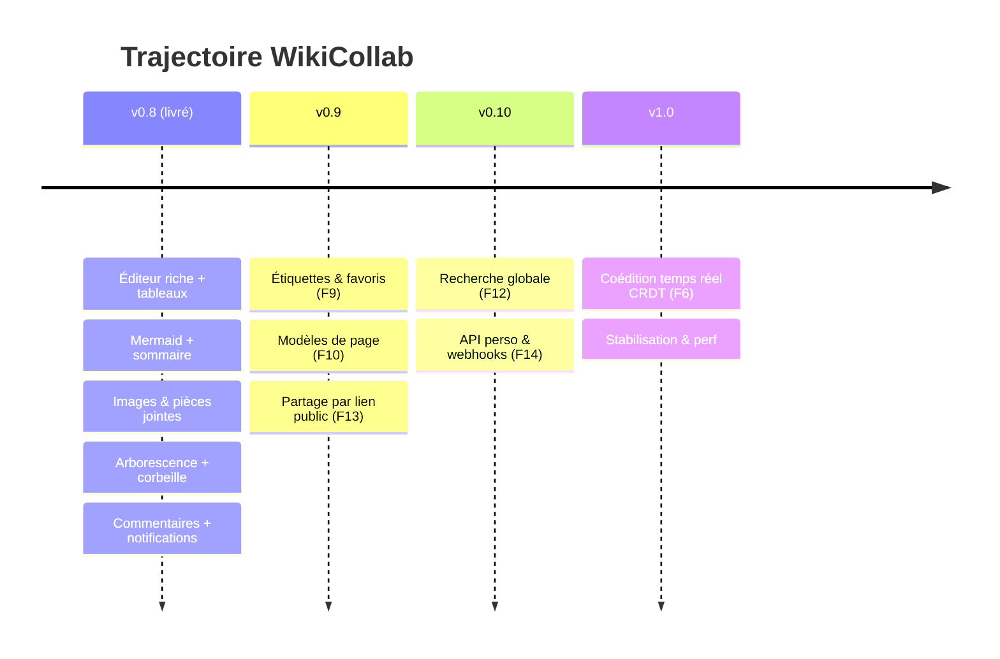
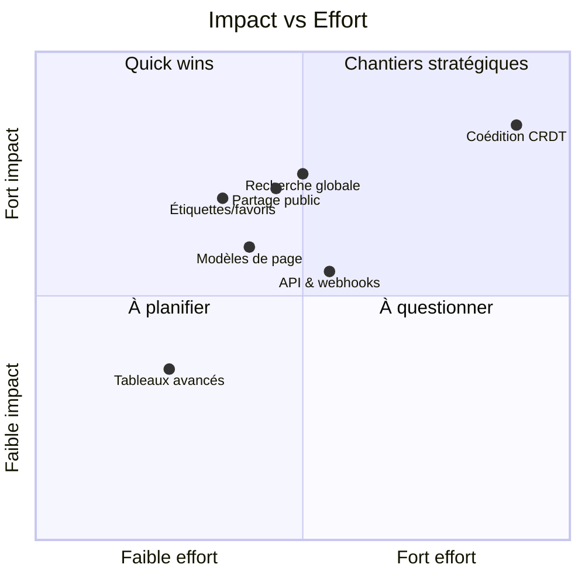

# Feuille de route — WikiCollab

[← Retour à l'index roadmap](README.md) · [Guide utilisateur](../README.md)

---

## Vision

Faire de WikiCollab le **wiki d'équipe temps-réel auto-hébergé** de référence :
édition riche et agréable, collaboration sans friction, organisation claire, et
ouverture (partage, intégrations) — tout en gardant la donnée **chez soi**.

Trois axes directeurs :

1. **Écrire mieux** — un éditeur qui ne se met jamais en travers.
2. **Collaborer sans se marcher dessus** — présence, verrous, commentaires, puis coédition fine.
3. **Organiser & diffuser** — hiérarchie, tags, modèles, recherche, partage, API.

---

## Chronologie

---

## Versions

### ✅ v0.8 — Édition & organisation (livré)

Barre d'outils + menu `/`, éditeur de tableaux visuels (export inclus), diagrammes
Mermaid, sommaire automatique, listes de tâches, images & pièces jointes (upload
différé hors-ligne), arborescence de pages, corbeille, commentaires en ligne avec
notifications.

### 🎯 v0.9 — Organisation & partage

Rendre les grands espaces navigables et ouvrir la lecture vers l'extérieur.

| Réf | Fonctionnalité | Effort | Dépend de |
|---|---|---|---|
| [F9](f09-etiquettes-et-favoris.md) | Étiquettes (tags) & favoris/épingles | M | — |
| [F10](f10-modeles-de-page.md) | Modèles de page (templates) | M | éditeur v0.8 |
| [F13](f13-partage-public.md) | Partage par lien public (lecture seule) | M | statut « Publié », rendu Markdown |

**Objectif de version** : classer, retrouver vite, et partager une page publiée
via une URL sans compte.

### 🎯 v0.10 — Recherche & intégrations

Passer à l'échelle multi-espaces et permettre l'automatisation.

| Réf | Fonctionnalité | Effort | Dépend de |
|---|---|---|---|
| [F12](f12-recherche-globale.md) | Recherche globale multi-espaces + filtres | M | recherche full-text existante |
| [F14](f14-api-et-webhooks.md) | Jetons API personnels & webhooks sortants | M | auth JWT existante |

### 🏁 v1.0 — Coédition temps réel

| Réf | Fonctionnalité | Effort | Dépend de |
|---|---|---|---|
| [F6](f06-coedition-temps-reel.md) | Coédition caractère-par-caractère (CRDT/Yjs) | XL | WebSocket/Channels, sections |

**Objectif** : remplacer les verrous de section par une édition simultanée fluide,
puis stabiliser (perf, tests de charge, montée de version).

### ⏳ Continu / optionnel

- [Finitions & dette technique](finitions.md) — au fil de l'eau.
- [Tableaux avancés](f15-tableaux-avances.md) — si le besoin de cellules fusionnées émerge.

---

## Priorisation (impact vs effort)

---

## Principes de mise en œuvre

- **Backend d'abord, testé** : chaque fonctionnalité serveur arrive avec ses tests `pytest`.
- **Hors-ligne pris en compte** : toute nouveauté d'édition considère le mode dégradé (desktop).
- **Permissions côté serveur** : l'UI masque, le serveur tranche.
- **Livraison par phases** : une version = un lot cohérent, mergé puis taggé (déclenche la release desktop).

---

*Cette feuille de route est indicative et peut évoluer selon les retours.*
