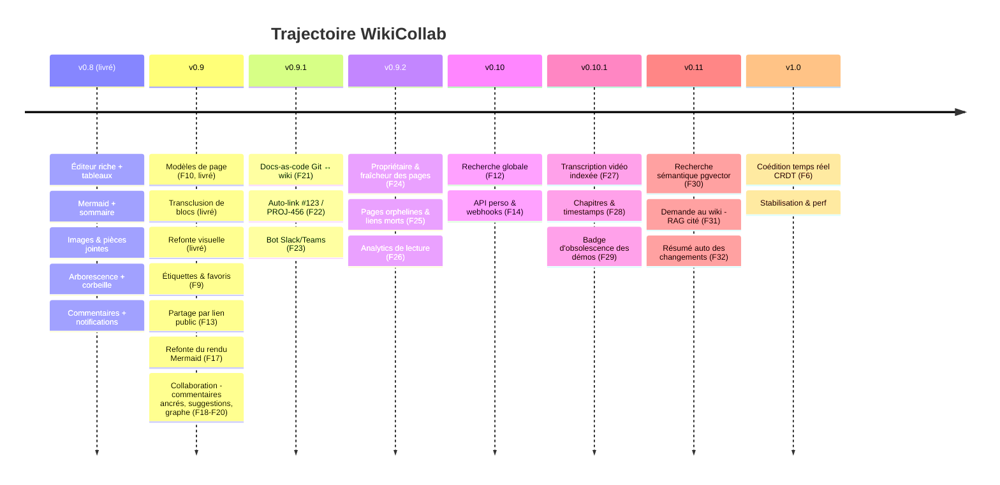
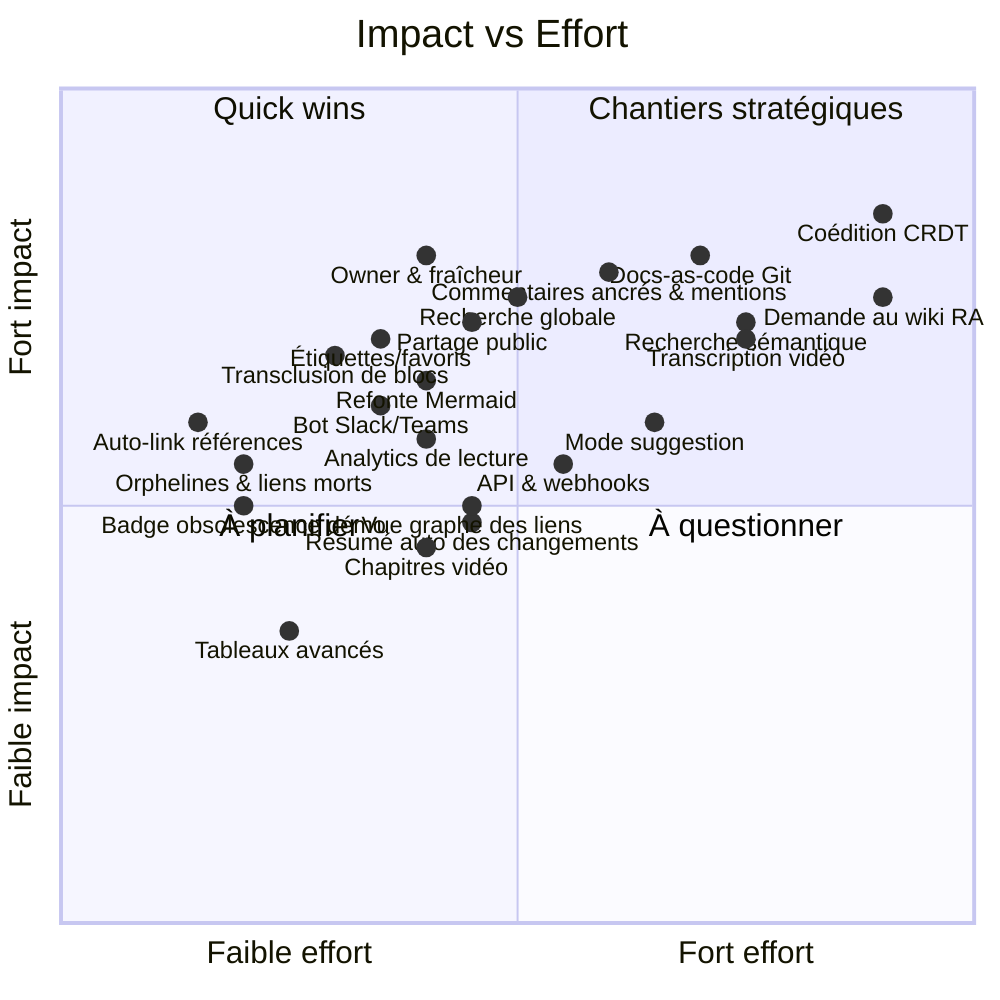

# Feuille de route — WikiCollab

[← Retour à l'index roadmap](README.md) · [Guide utilisateur](../README.md)

---

## Vision

Faire de WikiCollab le **wiki d'équipe temps-réel auto-hébergé** de référence :
édition riche et agréable, collaboration sans friction, organisation claire, et
ouverture (partage, intégrations) — tout en gardant la donnée **chez soi**.

Trois axes directeurs :

1. **Écrire mieux** — un éditeur qui ne se met jamais en travers.
2. **Collaborer sans se marcher dessus** — présence, verrous, commentaires, puis coédition fine.
3. **Organiser & diffuser** — hiérarchie, tags, modèles, recherche, partage, API.

---

## Chronologie

```mermaid
timeline
    title Trajectoire WikiCollab
    v0.8 (livré) : Éditeur riche + tableaux : Mermaid + sommaire : Images & pièces jointes : Arborescence + corbeille : Commentaires + notifications
    v0.9 : Modèles de page (F10, livré) : Transclusion de blocs (livré) : Refonte visuelle (livré) : Étiquettes & favoris (F9) : Partage par lien public (F13) : Refonte du rendu Mermaid (F17) : Collaboration - commentaires ancrés, suggestions, graphe (F18-F20)
    v0.9.1 : Docs-as-code Git ↔ wiki (F21) : Auto-link #123 / PROJ-456 (F22) : Bot Slack/Teams (F23)
    v0.9.2 : Propriétaire & fraîcheur des pages (F24) : Pages orphelines & liens morts (F25) : Analytics de lecture (F26)
    v0.10 : Recherche globale (F12) : API perso & webhooks (F14)
    v0.10.1 : Transcription vidéo indexée (F27) : Chapitres & timestamps (F28) : Badge d'obsolescence des démos (F29)
    v0.11 : Recherche sémantique pgvector (F30) : Demande au wiki - RAG cité (F31) : Résumé auto des changements (F32)
    v1.0 : Coédition temps réel CRDT (F6) : Stabilisation & perf
```

---

## Versions

### ✅ v0.8 — Édition & organisation (livré)

Barre d'outils + menu `/`, éditeur de tableaux visuels (export inclus), diagrammes
Mermaid, sommaire automatique, listes de tâches, images & pièces jointes (upload
différé hors-ligne), arborescence de pages, corbeille, commentaires en ligne avec
notifications.

### 🎯 v0.9 — Organisation & partage (en cours)

Rendre les grands espaces navigables et ouvrir la lecture vers l'extérieur.

Déjà livré dans cette version :

| Réf | Fonctionnalité | État |
|---|---|---|
| [F10](f10-modeles-de-page.md) | Modèles de page (4 modèles intégrés + modèles d'espace) | ✅ livré |
| [F16](f16-transclusion.md) | Transclusion de blocs (`![[page#section]]`) | ✅ livré |
| — | Refonte visuelle du design system + icônes lucide | ✅ livré |
| — | **Refonte de la disposition** : barre haute unique, rail de contexte (sommaire collant), barre latérale repliable et redimensionnable, menu par ligne d'arborescence, points de rupture 1280/1024/700 | ✅ livré |
| — | Typographie de lecture : corps en `--ink` à 16 px, mesure à 68 caractères, échelles de tokens (type, espacement, icônes) | ✅ livré |
| — | **Mentions `@user` en surbrillance** dans le Markdown rendu, alignées sur la détection serveur | ✅ livré |
| F17 | **Refonte du rendu Mermaid** (voir ci-dessous) | ⚠️ en partie |

Reste à faire :

| Réf | Fonctionnalité | Effort | Dépend de |
|---|---|---|---|
| [F9](f09-etiquettes-et-favoris.md) | Étiquettes (tags) & favoris/épingles | M | — |
| [F13](f13-partage-public.md) | Partage par lien public (lecture seule) | M | statut « Publié », rendu Markdown |
| F17b | Mermaid : diagrammes dans l'export `.docx` (rastérisation SVG → PNG) | S | `lib/export/docx.ts`, `lib/mermaid.ts` |
| F18 | Commentaires **ancrés sur un bloc** + mentions `@user` | L | commentaires & notifications existants |
| F19 | **Mode suggestion** : proposer une modification validée par un owner | L | rôles/permissions existants, sections |
| F20 | **Vue graphe** des liens entre pages (type Obsidian) | M | modèle `PageLink` existant |

**Objectif de version** : classer, retrouver vite, partager une page publiée via
une URL sans compte — et rendre la collaboration réellement conversationnelle
(commenter un bloc précis, proposer plutôt qu'écraser, visualiser le maillage).

#### F17 — Refonte du rendu Mermaid

Tout passe désormais par un module unique
([lib/mermaid.ts](../../frontend/src/lib/mermaid.ts)) : source → SVG, avec cache
et thème.

**Cause racine du « ça ne passe pas » historique.** Le rendu se faisait dans un
effet React qui cherchait les `<pre class="mermaid">` dans le DOM pour les
remplacer — un effet **non idempotent**, qui consommait le nœud dont il avait
besoin. L'application tourne en `StrictMode` ([main.tsx:11](../../frontend/src/main.tsx#L11)),
qui exécute chaque effet deux fois en développement : la seconde passe ne
trouvait plus rien et le diagramme restait à l'état de code source. L'impression
fonctionnait parce que c'est un simple appel de fonction, sans effet.

La correction ne rustine pas l'effet : elle le supprime. Les fences de premier
niveau sont **découpées avant le rendu Markdown**
([lib/mermaidBlocks.ts](../../frontend/src/lib/mermaidBlocks.ts)), donc un
diagramme est un enfant React ordinaire — plus rien à chercher, plus rien à
remplacer. Une fence imbriquée dans une liste reste dans son segment Markdown et
s'affiche comme bloc de code : source visible plutôt que trou silencieux.

Livré :

- ✅ **Affichage dans le lecteur** — la cause racine ci-dessus est éliminée, pas
  contournée.
- ✅ **Export PDF** — les diagrammes sont rendus en SVG avant impression
  (`inlineDiagrams`). Le PDF sortait jusqu'ici le code source du diagramme.
- ✅ **Changement de thème** — redessin au basculement clair ↔ sombre, en
  écoutant `data-theme` **et** la préférence système ([useIsDark](../../frontend/src/hooks/useIsDark.ts)).
- ✅ **Erreurs de syntaxe** — message en français avec le numéro de ligne, et la
  source repliée sous un `
`, au lieu de la boîte d'erreur brute de Mermaid.
- ✅ **Confort de lecture** — cadre à défilement propre (plus de diagramme qui
  déborde la colonne), zoom 50–300 %, téléchargement du SVG.
- ✅ **Coût de rendu** — cache par source + thème : une sauvegarde de section ne
  redessine plus tous les diagrammes de la page.

Reste (suivi en **F17b**) :

- **Export `.docx`** — Word n'accepte pas le SVG ; il faut rastériser en PNG
  (`createImageBitmap` + canvas) puis l'injecter comme média, dans le parcours
  d'images existant de [docx.ts](../../frontend/src/lib/export/docx.ts).
- **Partage public** — la page publique de F13 devra appeler `inlineDiagrams`
  côté client ; à faire avec F13, pas avant.
- **Aperçu pendant l'édition** — le diagramme n'apparaît qu'à la sortie du mode
  édition. À évaluer : l'intérêt réel dépend de l'usage.

**Critère d'acceptation** : un même diagramme s'affiche correctement en lecture,
dans l'export PDF et (F17b) dans le `.docx`, dans les deux thèmes, et une syntaxe
invalide affiche un message actionnable. Atteint sauf pour le `.docx`.

### 🎯 v0.9.1 — Intégration au workflow dev

Brancher le wiki sur les outils que l'équipe utilise déjà, pour que la doc suive
le code au lieu de le suivre de loin.

| Réf | Fonctionnalité | Effort | Dépend de |
|---|---|---|---|
| F21 | **Docs-as-code** : webhook de synchronisation des `.md` d'un dépôt Git vers le wiki (et inversement) | L | F14 (jetons API & webhooks), `PageVersion` |
| F22 | **Auto-link des références** `#123` / `PROJ-456` vers GitHub/Jira ou le module projet du SI | S | `lib/markdown.ts`, config par espace |
| F23 | **Bot Slack/Teams** : notification quand une page suivie change | M | `notify.update` ([services.py:167](../../backend/pages/services.py#L167)), F14 |

**Objectif de version** : plus aucune double saisie entre le dépôt et le wiki, et
une notification là où l'équipe discute déjà.

### 🎯 v0.9.2 — Fraîcheur & gouvernance de la doc

Une doc fausse coûte plus cher qu'une doc absente. Cette version rend la
péremption **visible** et **mesurable**.

| Réf | Fonctionnalité | Effort | Dépend de |
|---|---|---|---|
| F24 | **Propriétaire par page** + date de dernière vérification + rappel périodique (« cette page n'a pas été validée depuis 6 mois ») | M | rôles existants, notifications |
| F25 | Détection des **pages orphelines** et des **liens morts** | S | `PageLink` ([models.py:83](../../backend/pages/models.py#L83)) |
| F26 | **Analytics** : pages jamais lues, recherches sans résultat (= doc manquante à écrire) | M | recherche full-text, journalisation des vues |

**Objectif de version** : un tableau de bord d'espace qui répond à « qu'est-ce
qui est périmé, orphelin, ou attendu mais inexistant ? ».

### 🎯 v0.10 — Recherche & intégrations

Passer à l'échelle multi-espaces et permettre l'automatisation.

| Réf | Fonctionnalité | Effort | Dépend de |
|---|---|---|---|
| [F12](f12-recherche-globale.md) | Recherche globale multi-espaces + filtres | M | recherche full-text existante |
| [F14](f14-api-et-webhooks.md) | Jetons API personnels & webhooks sortants | M | auth JWT existante |

### 🎯 v0.10.1 — Vidéos de démo vivantes

Les captures de démo sont le contenu le plus consulté et le plus vite périmé :
les rendre **cherchables** et **datées**.

| Réf | Fonctionnalité | Effort | Dépend de |
|---|---|---|---|
| F27 | **Transcription automatique** de la vidéo, indexée dans la recherche full-text (retrouver une démo en cherchant ce qui y est dit) | L | pièces jointes, F12, tâche asynchrone (Whisper ou équivalent auto-hébergé) |
| F28 | **Chapitres cliquables** + timestamps liés aux sections de la page | M | lecteur vidéo intégré, ancres de sections |
| F29 | Badge « **vidéo tournée sur la version X** » + alerte quand la démo devient obsolète après un déploiement | S | métadonnée de version, F24 (fraîcheur) |

**Objectif de version** : une démo se retrouve par son contenu parlé, se navigue
par chapitres, et signale elle-même qu'elle ne correspond plus à l'application.

### 🎯 v0.11 — Recherche sémantique & IA

Compléter le FTS Postgres là où il échoue : la question posée avec d'autres mots
que ceux de la page.

| Réf | Fonctionnalité | Effort | Dépend de |
|---|---|---|---|
| F30 | **Recherche sémantique** avec `pgvector`, en complément du FTS Postgres | L | F12, extension Postgres, embeddings |
| F31 | « **Demande au wiki** » : RAG qui répond avec **citations vers les pages sources** | XL | F30, permissions par espace (le RAG ne cite que ce que le lecteur a le droit de voir) |
| F32 | **Résumé automatique des changements** d'une page depuis les `PageVersion` | M | `PageVersion` ([models.py:58](../../backend/pages/models.py#L58)) |

**Objectif de version** : réduire le temps d'onboarding — poser une question en
langage naturel et obtenir une réponse sourcée, jamais une réponse sans lien.

### 🏁 v1.0 — Coédition temps réel

| Réf | Fonctionnalité | Effort | Dépend de |
|---|---|---|---|
| [F6](f06-coedition-temps-reel.md) | Coédition caractère-par-caractère (CRDT/Yjs) | XL | WebSocket/Channels, sections |

**Objectif** : remplacer les verrous de section par une édition simultanée fluide,
puis stabiliser (perf, tests de charge, montée de version).

### ⏳ Continu / optionnel

- [Finitions & dette technique](finitions.md) — au fil de l'eau.
- [Tableaux avancés](f15-tableaux-avances.md) — si le besoin de cellules fusionnées émerge.

---

## Priorisation (impact vs effort)

```mermaid
quadrantChart
    title Impact vs Effort
    x-axis Faible effort --> Fort effort
    y-axis Faible impact --> Fort impact
    quadrant-1 Chantiers stratégiques
    quadrant-2 Quick wins
    quadrant-3 À planifier
    quadrant-4 À questionner
    Étiquettes/favoris: [0.35, 0.7]
    Transclusion de blocs: [0.3, 0.68]
    Partage public: [0.45, 0.72]
    Recherche globale: [0.5, 0.75]
    API & webhooks: [0.55, 0.55]
    Coédition CRDT: [0.9, 0.85]
    Tableaux avancés: [0.25, 0.35]
    Refonte Mermaid: [0.4, 0.65]
    Commentaires ancrés & mentions: [0.6, 0.78]
    Mode suggestion: [0.65, 0.6]
    Vue graphe des liens: [0.45, 0.5]
    Docs-as-code Git: [0.7, 0.8]
    Auto-link références: [0.15, 0.6]
    Bot Slack/Teams: [0.35, 0.62]
    Owner & fraîcheur: [0.4, 0.8]
    Orphelines & liens morts: [0.2, 0.55]
    Analytics de lecture: [0.4, 0.58]
    Transcription vidéo: [0.75, 0.7]
    Chapitres vidéo: [0.4, 0.45]
    Badge obsolescence démo: [0.2, 0.5]
    Recherche sémantique: [0.75, 0.72]
    Demande au wiki RAG: [0.9, 0.75]
    Résumé auto des changements: [0.45, 0.48]
```

**Lecture rapide** : les *quick wins* à sortir en premier sont l'**auto-link des
références** (F22), la détection **orphelines/liens morts** (F25) et le **badge
d'obsolescence** (F29) — faible effort, valeur immédiate. Les deux chantiers
structurants sont le **docs-as-code** (F21) et le **RAG cité** (F31).

---

## Thèmes transverses (demandes d'amélioration)

Les demandes remontées sont regroupées par thème ; chaque ligne renvoie à la
version où elle est planifiée.

| Thème | Demande | Réf | Version |
|---|---|---|---|
| **Contenu** | Diagrammes Mermaid réellement fiables partout (lecture, aperçu, public, exports) | F17 | v0.9 |
| **Collaboration** | Commentaires ancrés sur blocs + mentions `@user` | F18 | v0.9 |
| | Mode suggestion validé par un owner | F19 | v0.9 |
| | Vue graphe des liens (type Obsidian) | F20 | v0.9 |
| **Workflow dev** | Docs-as-code : sync `.md` Git ↔ wiki | F21 | v0.9.1 |
| | Auto-link `#123` / `PROJ-456` (GitHub, Jira, module projet du SI) | F22 | v0.9.1 |
| | Bot Slack/Teams sur page suivie | F23 | v0.9.1 |
| **Fraîcheur** | Owner + dernière vérification + rappel périodique | F24 | v0.9.2 |
| | Pages orphelines & liens morts | F25 | v0.9.2 |
| | Analytics : pages jamais lues, recherches sans résultat | F26 | v0.9.2 |
| **Vidéos de démo** | Transcription auto indexée dans le full-text | F27 | v0.10.1 |
| | Chapitres cliquables + timestamps liés aux sections | F28 | v0.10.1 |
| | Badge « tournée sur la version X » + alerte d'obsolescence | F29 | v0.10.1 |
| **Recherche & IA** | Recherche sémantique `pgvector` en complément du FTS | F30 | v0.11 |
| | « Demande au wiki » : RAG avec citations | F31 | v0.11 |
| | Résumé auto des changements depuis `PageVersion` | F32 | v0.11 |

Les spécifications détaillées F17 → F32 restent **à rédiger** ; elles suivront le
format des fiches existantes (objectif, user stories, conception, critères
d'acceptation).

---

## Principes de mise en œuvre

- **Backend d'abord, testé** : chaque fonctionnalité serveur arrive avec ses tests `pytest`.
- **Hors-ligne pris en compte** : toute nouveauté d'édition considère le mode dégradé (desktop).
- **Permissions côté serveur** : l'UI masque, le serveur tranche.
- **Livraison par phases** : une version = un lot cohérent, mergé puis taggé (déclenche la release desktop).

---

*Cette feuille de route est indicative et peut évoluer selon les retours.*
